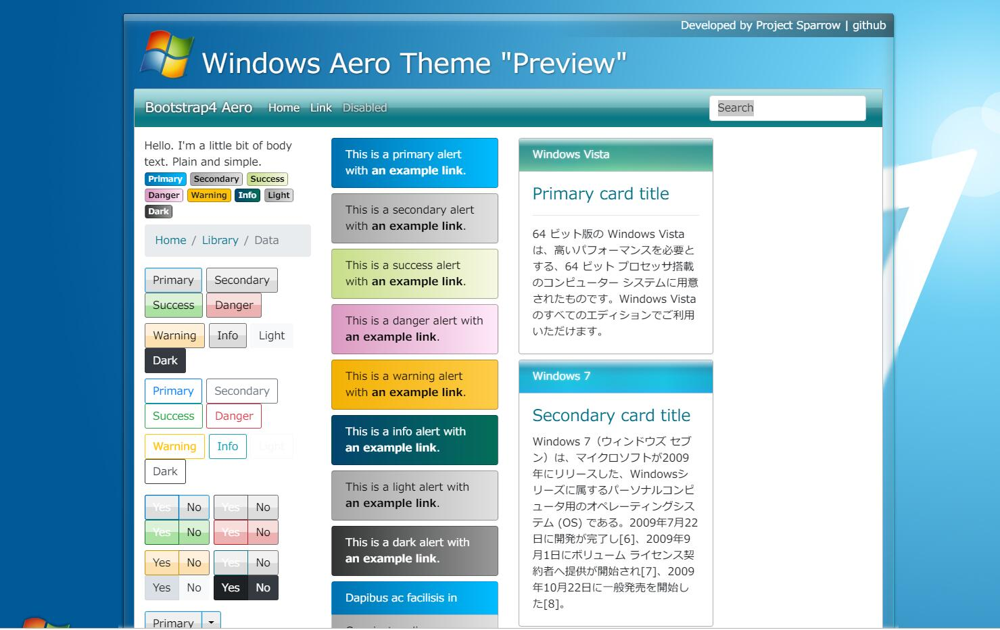

# Bootstrap aero
An aero theme for Bootstrap 4.1, since I hate currently popular web design ui style, especially flat design, so I've been looking for a long time for a theme that suits my aesthetic, but unfortunately, I didn't found any of them so I decided to make my own bootstrap 4 themes.
This time I turn to the previous version of windows vista / 7 aero style as the based of this theme. 
# Preview

## Enviroment requirement
- npm
- glup
## Modifications
all necessary scss files are defined in `scss` folder, if you wish to make the further modifications please modify the file inside that folder, the glup will automatic watch your changes and generate new `css` & `css.min` file in real-time.
## How to run
please `run npm install` to install all the dependency to your project, the use command  `npm run dev` to lunch the web server, it will prompt your browser & triggers glup watch & glup browser-sync to track your modification in real-time.